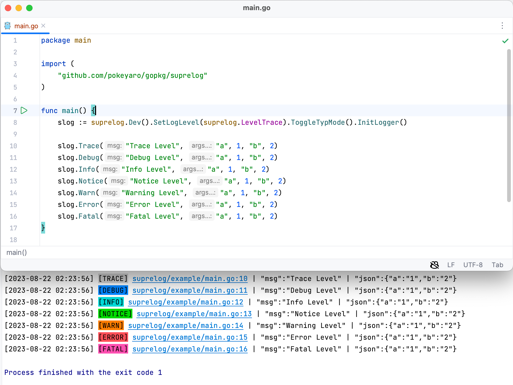

<div align=center>
  <br/>


[](https://godoc.org/github.com/pokeyaro/gopkg/suprelog)
[](https://raw.githubusercontent.com/pokeyaro/gopkg/master/LICENSE)
</div>

English | [中文](README_ZH_CN.md)


## Origin

The term `"Suprelog"` is derived from `"supreme"`, and we aim for this library to provide you with
a supreme experience while offering exceptional customizability.

With the inclusion of `slog` in the standard library of `Go 1.21`, we have carried out a reimplementation
based on its underlying `Handler` interface. This has enabled us to build a feature-rich, flexible, and
extensible logging library. Through `Suprelog`, you can effortlessly manage and record log information to
meet the needs of various scenarios. Whether it's for everyday development, debugging, or production
environments, `Suprelog` empowers you with robust logging capabilities.


## Installation

```bash
go get -u github.com/pokeyaro/gopkg/suprelog@master
```


## Dependencies

- `Go 1.21+`
- `Linux` / `MacOS` / `Windows` (Requires `Go 1.21+`)


## Features

- 🎭 Provides two user-friendly APIs: `Logger-style` and `Classical-style`
- 🪶 Capable of outputting data in both `Text` and `JSON` formats
- 🎨 Supports customizable background color schemes for different `Level` levels, with the option to render using either `RGB` or `HEX` formats
- 🧩 Includes various built-in `Handler` options, supports loading user configurations through `Chainable Setter` or `Option`
- 🎱 Offers hooks for callback methods specific to `Fatal` level logs


## Quick Start

### Simplest Log Example

```go
package main

import (
    "github.com/pokeyaro/gopkg/suprelog"
)

func main() {
    log := suprelog.New()
    log.Info("hello world")

    // Output:
    // [2023-08-21] | hello world
}
```

### Using Default Initialized Log

```go
package main

import (
    "github.com/pokeyaro/gopkg/suprelog"
)

func main() {
    log := suprelog.Default()
    log.Info("hello world")

    // Output:
    // [2023-08-21 00:03:59.857] [INFO] suprelog/example/main.go:9 | "msg":"hello world"
}
```

### Using Different Log Levels

```go
package main

import (
    "github.com/pokeyaro/gopkg/suprelog"
)

func main() {
    log := suprelog.Default()
    log.Trace("trace level")
    log.Debug("debug level")
    log.Info("info level")
    log.Notice("notice level")
    log.Warn("warn level")
    log.Error("error level")
    log.Fatal("fatal level")

    // Output:
    // [2023-08-21 00:03:59.857] [DEBUG] suprelog/example/main.go:10 | "msg":"debug level"
    // [2023-08-21 00:03:59.857] [INFO] suprelog/example/main.go:11 | "msg":"info level"
    // [2023-08-21 00:03:59.857] [NOTICE] suprelog/example/main.go:12 | "msg":"notice level"
    // [2023-08-21 00:03:59.857] [WARN] suprelog/example/main.go:13 | "msg":"warn level"
    // [2023-08-21 00:03:59.857] [ERROR] suprelog/example/main.go:14 | "msg":"error level"
    // [2023-08-21 00:03:59.857] [FATAL] suprelog/example/main.go:15 | "msg":"fatal level"
    // Process finished with the exit code 1
}
```

Note: The default log level is `Debug`, and `Trace` level is not printed by default.

### Printf Style and Contextual Logging with Ctx

```go
package main

import (
    "context"

    "github.com/pokeyaro/gopkg/suprelog"
)

func main() {
    log := suprelog.Default()
    log.Info("hello world")
    log.Infof("hello %s", "world")
    log.InfoCtx(context.TODO(), "hello world")

    // Output:
    // [2023-08-21 00:03:59.857] [INFO] suprelog/example/main.go:11 | "msg":"hello world"
    // [2023-08-21 00:03:59.857] [INFO] suprelog/example/main.go:12 | "msg":"hello world"
    // [2023-08-21 00:03:59.857] [INFO] suprelog/example/main.go:13 | "msg":"hello world"
}
```

### Structured KV Logging in Text and JSON Formats

```go
package main

import (
    "github.com/pokeyaro/gopkg/suprelog"
)

func main() {
    tlog := suprelog.ConsoleHandler().InitLogger()
    tlog.Info("hello world", "name", "John", "age", 30, "is_male", true)

    jlog := suprelog.ConsoleHandler().ToggleTypMode().InitLogger()
    jlog.Info("hello world", "name", "John", "age", 30, "is_male", true)

    // Output:
    // [2023-08-21 00:03:59.857] [INFO] suprelog/example/main.go:9 | "msg":"hello world" | "text":"name=John age=30 is_male=true"
    // [2023-08-21 00:03:59.857] [INFO] suprelog/example/main.go:12 | "msg":"hello world" | "json":{"name":"John","age":"30","is_male":"true"}
}
```

### Customizable HandlerOptions

```go
package main

import (
    "context"
    "fmt"
    "log/slog"
    "os"
    "time"

    "github.com/pokeyaro/gopkg/suprelog"
)

func main() {
    logger := suprelog.HandlerOptions(
        suprelog.WithWriter(os.Stdout),
        suprelog.WithBuiltinSort([]string{suprelog.FieldLevel, suprelog.FieldTime, suprelog.FieldPos}),
        suprelog.WithExitCode(99),
        suprelog.WithAbsPath(false),
        suprelog.WithTimeFormat(time.DateTime),
        suprelog.WithColorful(true),
        suprelog.WithColorScale(suprelog.ColorTheme("arco")),
        suprelog.WithMode(suprelog.NewMode().SetLog(suprelog.ModeSimplify)),
        suprelog.WithFatalHook(func(ctx context.Context, rec slog.Record) error {
            fmt.Println("This is a fatal callback function!")
            return nil
        }),
        suprelog.WithLogLevel(suprelog.LevelTrace),
    ).InitLogger()

    logger.Fatal("hello world")

    // Output:
    // [FATAL] [2023-08-21 00:03:59] suprelog/example/main.go:31 | hello world
    // This is a fatal callback function!
    // Process finished with the exit code 99
}
```

### Tailor-Made Color Schemes for Your Levels

```go
package main

import (
    "github.com/pokeyaro/gopkg/suprelog"
)

func main() {
    colorScheme := suprelog.ColorScale{
        IsRGB: true,
        Colors: []suprelog.ColorItem{
            {
                Level: "TRACE",
                RGB:   []int{201, 205, 212},
            },
            {
                Level: "DEBUG",
                RGB:   []int{22, 93, 255},
            },
            {
                Level: "INFO",
                RGB:   []int{20, 201, 201},
            },
            {
                Level: "NOTICE",
                RGB:   []int{0, 180, 42},
            },
            {
                Level: "WARN",
                RGB:   []int{255, 125, 0},
            },
            {
                Level: "ERROR",
                RGB:   []int{245, 63, 63},
            },
            {
                Level: "FATAL",
                RGB:   []int{245, 49, 157},
            },
        },
    }

    log := suprelog.ConsoleHandler().SetColorScale(&colorScheme).ToggleLogColorful().InitLogger()
    log.Info("hello arco")

    // Output:
    // [2023-08-21 00:03:59.857] [INFO] suprelog/example/main.go:43 | "msg":"hello arco"
}
```

Note: For more details, refer to the [color.go](./color.go) file. 
The ColorTheme function provides built-in color schemes, including `Chinese` colors, `arco-design` version, `ant-design` version, and `element-plus` version.

### Classic Chainable API

```go
package main

import (
    "context"
    "errors"

    "github.com/pokeyaro/gopkg/suprelog"
)

func main() {
    log := suprelog.ConsoleHandler().InitClassical()

    ctxKey := "key"
    err := errors.New("it's error")
    ctxWithValue := context.WithValue(context.Background(), ctxKey, "value")

    log.Info().
        Str("hello world").
        Str("Hi %s", "~").
        Int(123).
        Obj([]any{"abc", 456, 'o'}).
        Err(err).
        Ctx(ctxWithValue, ctxKey).
        Emit()

    // Output:
    // [2023-08-21 00:03:59.857] [INFO] suprelog/example/main.go:24 | "msg":"hello world - Hi ~ - 123 - [abc 456 111] - it's error - value"
}
```


## Code Examples

[example.go](./example_test.go)




## More API Function Signatures

`Logger/Classical` Initialization

```go
func Default() Logger
func DefaultLogger() Logger
func DefaultClassical() Classical

func New(funcs ...HandlerFunc) Logger
```

`Entry` Implements the `Logger` Interface

```go
func NewEntry(h slog.Handler) *Entry

func (e *Entry) Trace(msg string, args ...any)
func (e *Entry) Tracef(format string, args ...any)
func (e *Entry) TraceCtx(ctx context.Context, msg string, args ...any)
func (e *Entry) Debug(msg string, args ...any)
func (e *Entry) Debugf(format string, args ...any)
func (e *Entry) DebugCtx(ctx context.Context, msg string, args ...any)
func (e *Entry) Info(msg string, args ...any)
func (e *Entry) Infof(format string, args ...any)
func (e *Entry) InfoCtx(ctx context.Context, msg string, args ...any)
func (e *Entry) Notice(msg string, args ...any)
func (e *Entry) Noticef(format string, args ...any)
func (e *Entry) NoticeCtx(ctx context.Context, msg string, args ...any)
func (e *Entry) Warn(msg string, args ...any)
func (e *Entry) Warnf(format string, args ...any)
func (e *Entry) WarnCtx(ctx context.Context, msg string, args ...any)
func (e *Entry) Error(msg string, args ...any)
func (e *Entry) Errorf(format string, args ...any)
func (e *Entry) ErrorCtx(ctx context.Context, msg string, args ...any)
func (e *Entry) Fatal(msg string, args ...any)
func (e *Entry) Fatalf(format string, args ...any)
func (e *Entry) FatalCtx(ctx context.Context, msg string, args ...any)
```

`Classic` Implements the `Classical` Interface

```go
func NewClassic(h slog.Handler) *Classic

func (c *Classic) Level(l Level) *Classic

func (c *Classic) Trace() Classical
func (c *Classic) Debug() Classical
func (c *Classic) Info() Classical
func (c *Classic) Notice() Classical
func (c *Classic) Warn() Classical
func (c *Classic) Error() Classical
func (c *Classic) Fatal() Classical

func (c *Classic) Str(format string, a ...any) Classical
func (c *Classic) Int(i int) Classical
func (c *Classic) Err(err error) Classical
func (c *Classic) Obj(obj any) Classical
func (c *Classic) Ctx(ctx context.Context, contextKey string) Classical
func (c *Classic) Emit()
```

`Handler` Implements the `slog.Handler` Interface

```go
func NewHandler(w io.Writer) *Handler

func (h *Handler) Enabled(_ context.Context, level slog.Level) bool
func (h *Handler) Handle(ctx context.Context, r slog.Record) error
func (h *Handler) WithAttrs(as []slog.Attr) slog.Handler
func (h *Handler) WithGroup(name string) slog.Handler
```

`Handler` Options Functions

```go
func HandlerOptions(funcs ...HandlerFunc) *Handler

func WithWriter(w io.Writer) HandlerFunc
func WithBuiltinSort(sorts []string) HandlerFunc
func WithLevel(l Level) HandlerFunc
func WithExitCode(code int) HandlerFunc
func WithAbsPath(isAbs bool) HandlerFunc
func WithTimeFormat(timeFmt string) HandlerFunc
func WithColorful(isColorful bool) HandlerFunc
func WithColorScale(colors *ColorScale) HandlerFunc
func WithMode(mode *Mode) HandlerFunc
func WithFatalHook(hook func(ctx context.Context, rec slog.Record) error) HandlerFunc
```

`Handler` Setter Method Chains

```go
func Dev() *Handler
func Prod() *Handler

func ConsoleHandler() *Handler

func (h *Handler) SetLogLevel(l Level) *Handler
func (h *Handler) SetBuiltinSort(sorts []string) *Handler
func (h *Handler) SetTimeFormat(format string) *Handler
func (h *Handler) SetColorScale(cs *ColorScale) *Handler
func (h *Handler) SetFatalHook(hook func(ctx context.Context, rec slog.Record) error) *Handler

func (h *Handler) ToggleLogPath() *Handler
func (h *Handler) ToggleLogMode() *Handler
func (h *Handler) ToggleTypMode() *Handler
func (h *Handler) ToggleLogColorful() *Handler

func (h *Handler) InitLogger() Logger
func (h *Handler) InitClassical() Classical
```

`Mode` Methods

```go
func NewMode() *Mode
func (m *Mode) SetLog(log int) *Mode
func (m *Mode) SetTyp(typ string) *Mode
```

`Color` Methods

```go
func NewColorScale() *ColorScale
func ColorTheme(theme string) *ColorScale
```

`Level` Methods

```go
func (l Level) String() string
func (l Level) Level() slog.Level
func (l Level) Int() int
```


## More Entity Values

`Level` Enum: Used to set `Handler.Level`, with functions like `WithLogLevel` and `SetLogLevel`

```textmate
LevelTrace
LevelDebug
LevelInfo
LevelNotice
LevelWarn
LevelError
LevelFatal
```

Built-in Field Enum: Used to set `Handler.builtinSort`, with functions like `WithBuiltinSort` and `SetBuiltinSort`

```textmate
FieldTime
FieldLevel
FieldPos
```

`Mode` Enum: Used to set `Handler.mode`, with functions like `SetLog` and `SetTyp`

```textmate
// Log Output Formats
ModeSimplify
ModeDetail

// Log Output Types
ModeText
ModeJson
```

`Color` Theme Enum: Used to set `Handler.colorScale`, with functions like `ColorTheme`

```textmate
"arco" | "ant" | "element" | "china"
```


## Benchmarks

```textmate
# Initialize the log using New, record a single message:
Benchmark_New-10                             15337       75711 ns/op       0.08 MB/s       4320 B/op         12 allocs/op

# Initialize the log using New, record printf-style with 10 fields:
Benchmark_New-10                             11457       90444 ns/op       0.72 MB/s       8592 B/op         130 allocs/op

# Initialize the log using New, record kv-style with 10 fields:
Benchmark_New-10                             11643       94452 ns/op       0.95 MB/s       11937 B/op        180 allocs/op

# Initialize the log using Default, record a single message:
Benchmark_Default-10                         12025       94925 ns/op       0.18 MB/s       6253 B/op         34 allocs/op

# Initialize the log using Default, record printf-style with 10 fields:
Benchmark_Default-10                         16717      118595 ns/op       0.64 MB/s       13601 B/op        152 allocs/op

# Initialize the log using Default, record kv-style with 10 fields:
Benchmark_Default-10                         22708      115781 ns/op       0.88 MB/s       13905 B/op        204 allocs/op

# Initialize the log using HandlerOptions, record a single message:
Benchmark_HandlerOptions_InitLogger-10       14145       80830 ns/op       0.24 MB/s       5405 B/op         38 allocs/op

# Initialize the log using HandlerOptions, record printf-style with 10 fields:
Benchmark_HandlerOptions_InitLogger-10        9685      108788 ns/op       0.72 MB/s       12753 B/op        156 allocs/op

# Initialize the log using HandlerOptions, record kv-style with 10 fields:
Benchmark_HandlerOptions_InitLogger-10       10000      114179 ns/op       0.91 MB/s       13025 B/op        208 allocs/op

# Initialize the log using DefaultClassical, record a single message:
Benchmark_DefaultClassical-10                10000      115148 ns/op       0.66 MB/s       13041 B/op        152 allocs/op

# Initialize the log using DefaultClassical, record printf-style with 10 fields:
Benchmark_DefaultClassical-10                10000      119092 ns/op       0.64 MB/s       13041 B/op        152 allocs/op

# Initialize the log using HandlerOptions + InitClassical, record printf-style with 10 fields:
Benchmark_HandlerOptions_InitClassical-10    10000      120545 ns/op       0.68 MB/s       15681 B/op        164 allocs/op
```

**Performance:** When compared to the built-in `slog` library, `Superlog` exhibits an increase of approximately `13.28%` in `allocs/op`.
This additional memory overhead is attributed to its enhanced features, customization, and abstraction, leading to a slight performance reduction.


## Contribution

Your contributions are highly welcome! If you come across any improvements or issues that need fixing,
please feel free to submit a pull request. I appreciate pull requests that include test cases specifically
addressing the fixes or enhancements.

By the way, I'd love to hear your thoughts about the `Suprelog` library. Feel free to submit issues or
drop me an email. it's valuable to me.


## Creator

[Pokeya Boa](https://github.com/pokeyaro)&nbsp;(<a href="mailto:pokeya.mystic@gmail.com">pokeya.mystic@gmail.com</a>)


## License

`Suprelog` released under MIT license, refer [LICENSE](../LICENSE) file.